# Shopy-R E-commerce Platform

## Project Screenshots

### Homepage
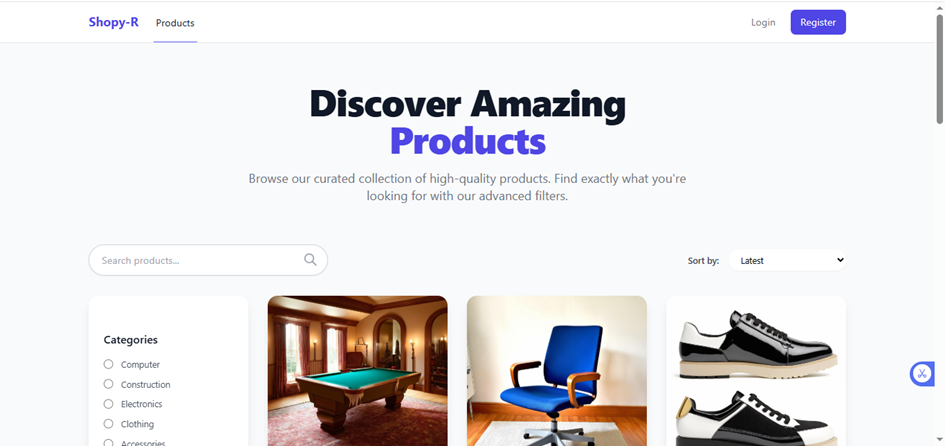
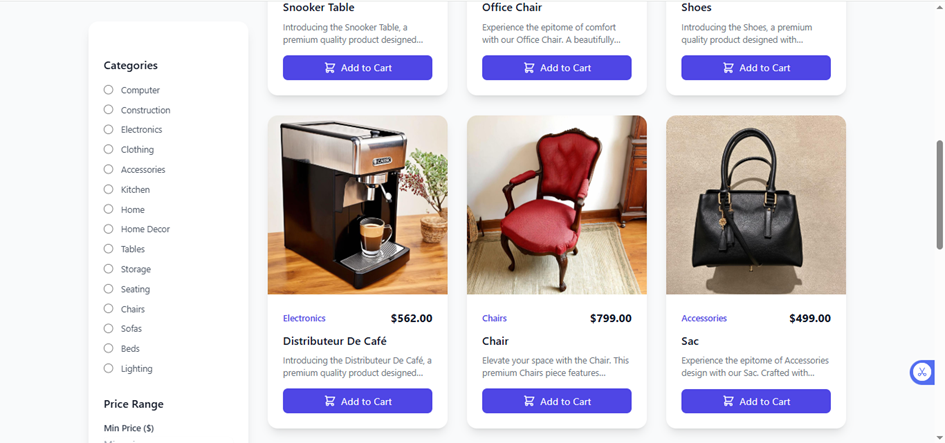

### Admin Dashboard
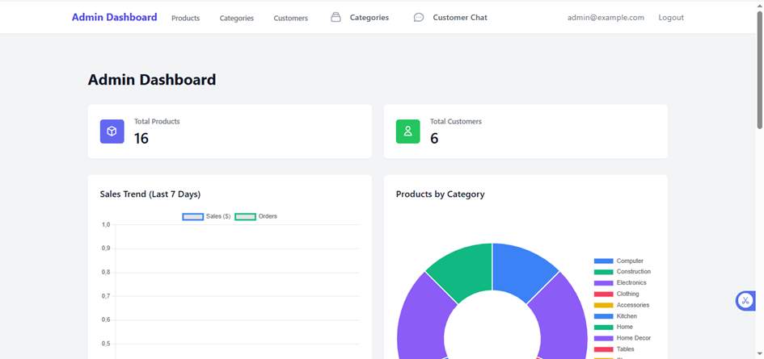
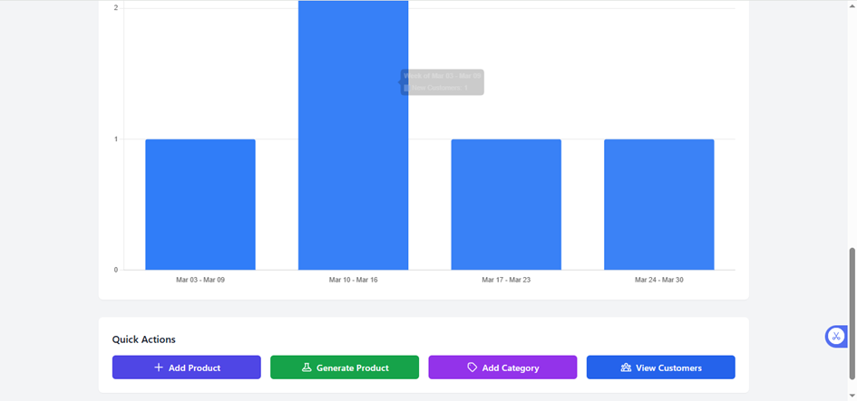

### Product Management
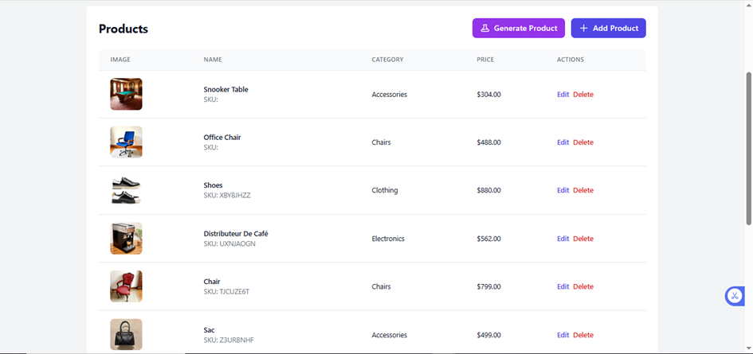
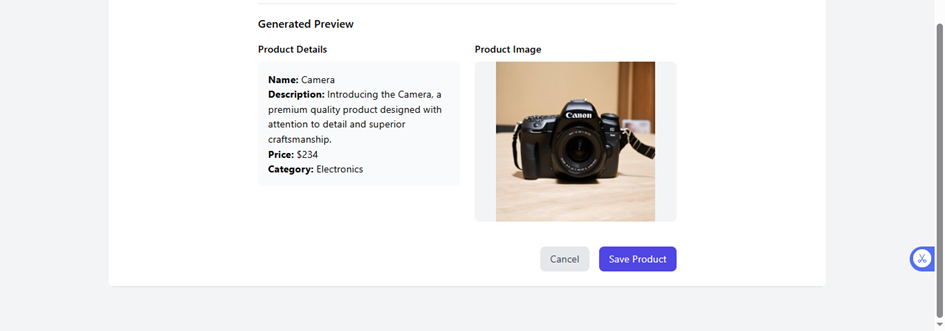
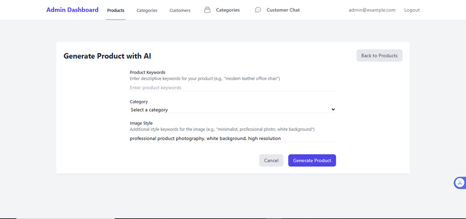

### User Features
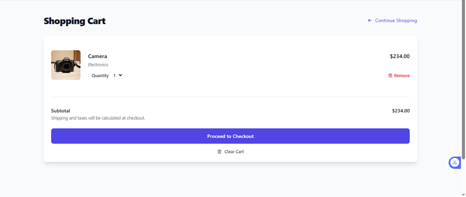
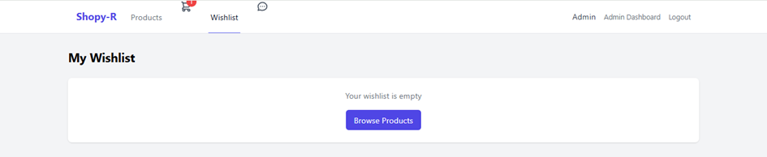
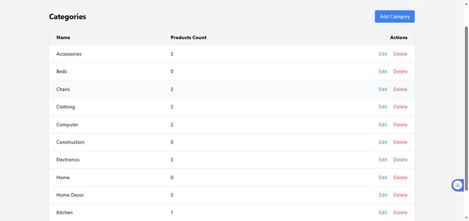

### Authentication
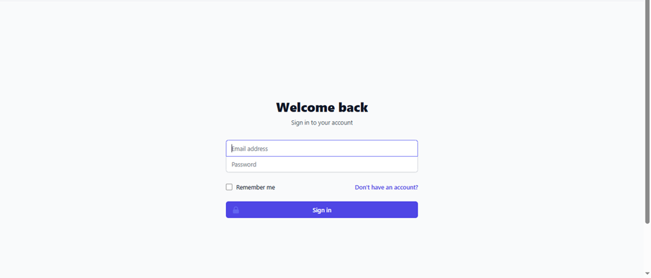

### Communication
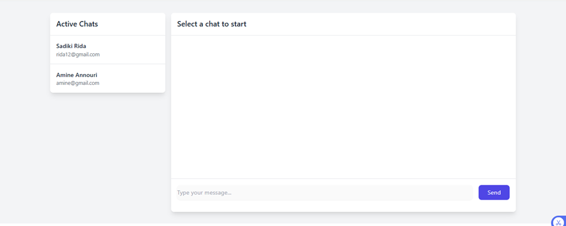

## About The Project

Shopy-R is a modern e-commerce platform built with Laravel, offering a robust shopping experience with features like:
- User authentication and authorization
- Product management with automatic generation
- Shopping cart functionality
- Wishlist management
- Category-based product organization
- Admin dashboard
- Chat system
- Responsive design

## Technical Stack

- **Framework:** Laravel
- **Frontend:** Blade templates, CSS, JavaScript
- **Database:** MySQL
- **Authentication:** Laravel built-in auth

## Installation

1. Clone the repository
2. Run `composer install`
3. Copy `.env.example` to `.env` and configure your database
4. Run `php artisan key:generate`
5. Run `php artisan migrate`
6. Run `php artisan serve`

## About Laravel

Laravel is a web application framework with expressive, elegant syntax. Laravel takes the pain out of development by easing common tasks used in many web projects, such as:

- [Simple, fast routing engine](https://laravel.com/docs/routing)
- [Powerful dependency injection container](https://laravel.com/docs/container)
- Multiple back-ends for [session](https://laravel.com/docs/session) and [cache](https://laravel.com/docs/cache) storage
- Database agnostic [schema migrations](https://laravel.com/docs/migrations)
- [Robust background job processing](https://laravel.com/docs/queues)
- [Real-time event broadcasting](https://laravel.com/docs/broadcasting)

## Learning Laravel

Laravel has the most extensive and thorough [documentation](https://laravel.com/docs) and video tutorial library of all modern web application frameworks, making it a breeze to get started with the framework.

You may also try the [Laravel Bootcamp](https://bootcamp.laravel.com), where you will be guided through building a modern Laravel application from scratch.

If you don't feel like reading, [Laracasts](https://laracasts.com) can help. Laracasts contains thousands of video tutorials on a range of topics including Laravel, modern PHP, unit testing, and JavaScript. Boost your skills by digging into our comprehensive video library.

## Laravel Sponsors

We would like to extend our thanks to the following sponsors for funding Laravel development. If you are interested in becoming a sponsor, please visit the [Laravel Partners program](https://partners.laravel.com).

### Premium Partners

- **[Vehikl](https://vehikl.com/)**
- **[Tighten Co.](https://tighten.co)**
- **[WebReinvent](https://webreinvent.com/)**
- **[Kirschbaum Development Group](https://kirschbaumdevelopment.com)**
- **[64 Robots](https://64robots.com)**
- **[Curotec](https://www.curotec.com/services/technologies/laravel/)**
- **[Cyber-Duck](https://cyber-duck.co.uk)**
- **[DevSquad](https://devsquad.com/hire-laravel-developers)**
- **[Jump24](https://jump24.co.uk)**
- **[Redberry](https://redberry.international/laravel/)**
- **[Active Logic](https://activelogic.com)**
- **[byte5](https://byte5.de)**
- **[OP.GG](https://op.gg)**

## Contributing

Thank you for considering contributing to the Laravel framework! The contribution guide can be found in the [Laravel documentation](https://laravel.com/docs/contributions).

## Code of Conduct

In order to ensure that the Laravel community is welcoming to all, please review and abide by the [Code of Conduct](https://laravel.com/docs/contributions#code-of-conduct).

## Security Vulnerabilities

If you discover a security vulnerability within Laravel, please send an e-mail to Taylor Otwell via [taylor@laravel.com](mailto:taylor@laravel.com). All security vulnerabilities will be promptly addressed.

## License

The Laravel framework is open-sourced software licensed under the [MIT license](https://opensource.org/licenses/MIT).
